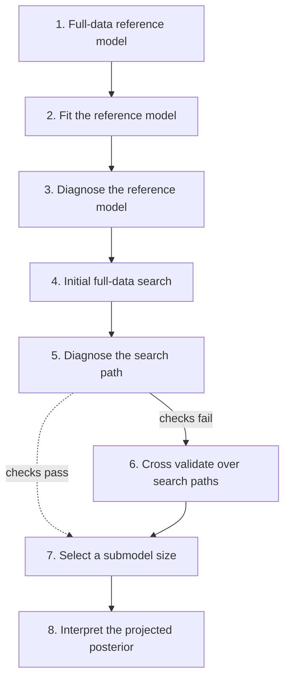

# Models for Regression Coefficients and Variable Selection: Student Grades

> [!summary]
> Predicting Portuguese high-school students' median exam grades (math $n=382$, Portuguese $n=657$) from 26 mixed predictors. The chapter's thesis: **with a predictively consistent prior you do not need variable selection to avoid overfitting** — a flat prior gives Bayesian $R^2 = 0.32$ against LOO-$R^2 = 0.19$, but R2D2, regularized horseshoe, and scaled-normal priors all give honest, near-identical predictive performance. Variable selection is then a *decision problem* about interpretability and measurement cost, solved by projection predictive selection (`projpred`), which cuts 26 predictors to 4 (math) or 7 (Portuguese) with negligible elpd loss.

## Overview

Data: Cortez and Silva (2008), also used in Chapter 12 of *Regression and Other Stories*. Median of three exam scores per subject per student, dropping zeros. 26 potential predictors: school, sex, age, address type, family size, parents' cohabitation status, mother's and father's education (`Medu`, `Fedu`), travel time, weekly study time, past class failures, extra school support (`schoolsup`), family support, paid classes, extracurricular activities, nursery attendance, wanting higher education, internet at home, romantic relationship, family relationship quality, free time, going out, weekday and weekend alcohol (`Dalc`, `Walc`), health, and absences.

Coding conventions that make relevance comparable across predictors:
- **binary predictors coded $\pm 1$**
- **all non-binary predictors standardized to sd 1**

This follows Section 12.1 of *Regression and Other Stories* — without it, "relevance order" from a selection algorithm mixes up effect size and predictor scale.

Two questions are kept strictly separate:
1. **Modeling**: what prior encodes our assumptions about 26 coefficients? (Sections 28.2–28.4)
2. **Decision**: what is the smallest predictor set with essentially the reference model's predictive performance? (Section 28.5)

## Main Content

### The failure of the default flat prior

`brms` uses improper uniform ("flat") priors on regression coefficients by default:

```r
fitmu <- brm(Gmat ~ ., data = studentstd_Gmat)
```

Diagnosis by the **Bayesian $R^2$ vs. LOO-$R^2$ gap** (see [[Cross Validation Checking]]):

| Quantity | Value |
|---|---|
| Bayesian (posterior) $R^2$ | 0.32 |
| LOO-$R^2$ | 0.19 |

A 0.13 gap is the signature of overfitting driven by the prior. Figure 28.2 shows the consequence directly: many marginal posteriors are wide and put mass on unrealistically large coefficient values.

> [!warning] Two practical consequences of an improper flat prior
> 1. The posterior can be proper while the model still overfits badly.
> 2. **You cannot sample from an improper unbounded uniform prior**, so you cannot do [[Prior Predictive Checking]] or compute an implied prior on $R^2$. Every prior compared below is proper for this reason.

### The piranha principle

> [!definition] The piranha principle (Tosh et al. 2025)
> It should be very unlikely that **many different independent predictors all have large coefficients**, because then the outcome would be unstable — large effects would collide and cancel or explode. Therefore, when there are many predictors, the prior must encode that *not all* coefficients can be large.
^def-piranha

Independent wide normal priors violate this: each coefficient is individually plausible, but jointly they imply an implausible amount of total explained variation. Two remedies:
- Divide the normal prior variance by the number of predictors, keeping total prior variance constant (valid when predictors are normalized).
- Use a more elaborate **joint** prior on the coefficient vector.

### Predictively consistent priors

> [!definition] Predictively consistent prior
> A prior is **predictively consistent** if the **total prior predictive distribution stays (almost) constant as more model components are added**. Adding components makes the model more flexible — able to capture more complex phenomena — without the prior favoring overfitting to noise.
^def-predictively-consistent

This is the same principle as in [[Model Expansion - Predictive Consistency and Coherence]]: model expansion should not silently inflate the prior predictive spread.

> [!warning] Priors are not selection criteria
> People sometimes speak of "priors for variable selection." The prior represents **information or assumptions about the underlying process**; variable selection is a **decision task depending on costs and benefits**. If a prior is being chosen to accomplish selection, that intent belongs in a utility function instead. The book's recommendation: **first formulate the prior as part of the statistical model, then treat variable selection as post-processing of the fitted model's inferences.**

### Implied priors on $R^2$

Bayesian $R^2$ (Gelman, Goodrich, Gabry, et al. 2019) depends only on model parameters, not on residuals, so it can be computed from **prior draws**. That gives a direct, interpretable way to audit a coefficient prior: sample from the prior and look at the induced distribution of explained variance.

Common residual-scale prior for all four models: `brms` default $t_3^+(0,3)$ (a $t_3$ constrained positive), very weak given the data's sd of 3.3.

The four coefficient priors compared:

| # | Prior | brms specification | Assumption encoded |
|---|---|---|---|
| 1 | Independent wide normal | `prior(normal(0, 2.5), class=b)` | Weakly informative *for a single coefficient* (rstanarm default) |
| 2 | Independent scaled normal | `prior(normal(0, scale_b), class=b)` + `stanvars=stanvar(scale_b, name="scale_b")` | Many predictors each with small relevance; $\text{sd} = \sqrt{0.3/26}\,\text{sd}(y)$ for a prior guess $R^2 \approx 0.3$ over 26 predictors. **No sparsity.** |
| 3 | Regularized horseshoe | `prior(horseshoe(scale_global=..., scale_slab=...), class=b)` | **Strong sparsity**; global scale set from a guess of ~6 relevant coefficients. Result is insensitive to the exact guess — it only sets the prior mean. |
| 4 | R2D2 | `prior(R2D2(mean_R2=1/3, prec_R2=3, cons_D2=1/2), class=b)` | Prior placed **directly on $R^2$**, then propagated to coefficients. Mean $1/3$, precision 3 $\Rightarrow$ $\text{beta}(1,2)$ on $R^2$ (higher $R^2$ less likely); concentration $1/2$ $\Rightarrow$ some coefficients big, some small. Between #2 and #3 in sparsity. |

Notes on mechanics: the regularized horseshoe (Piironen and Vehtari 2017b) is a joint prior on coefficients that **also depends on the residual scale**; likewise R2D2 (Zhang, Naughton, et al. 2022) is a joint distribution over coefficients *and* scale, since $R^2$ depends on the residual scale. `scale_global` and `scale_slab` are special names that `brms` forwards to Stan without a `stanvar`. The `brms` R2D2 implementation **assumes predictors have unit variance**.

Figure 28.3 findings:

| Prior | Implied prior on $R^2$ (panel a) | Effect on posterior |
|---|---|---|
| Wide normal | Strongly favors $R^2 \approx 1$ | Pushes posterior $R^2$ up $\Rightarrow$ overfits $\Rightarrow$ **lowest LOO-$R^2$** |
| Scaled normal | Relatively flat | Sensible; posterior not pulled upward |
| Regularized horseshoe | Favors values near 0 | Sensible; slightly less posterior uncertainty |
| R2D2 | Relatively flat | Sensible; slightly less posterior uncertainty |

> [!tip] Look at the prior where the likelihood lives
> Judging an implied prior over its whole range can mislead. Figure 28.3a spans $[0,1]$; Figure 28.3b zooms to the range where the likelihood is non-negligible, and panels c–d show posterior-$R^2$ and LOO-$R^2$ on that same restricted scale. **The behavior of the prior in the region the likelihood supports is what matters.** The horseshoe favors small $R^2$ more strongly than the others, but because the likelihood has thin tails toward small $R^2$ it is informative in that direction and the posteriors barely differ.

elpd comparison via LOO (see [[Model Selection Using Predictive Performance]]):

```
             elpd_diff  se_diff
R2D2               0.0      0.0
Scaled normal     -0.4      1.6
Horseshoe         -0.5      0.5
Wide normal       -4.1      2.6
```

R2D2 beats the wide normal with probability 0.94. The gaps to scaled normal and horseshoe are within noise. **Reading:** as long as you avoid the prior that pushes toward overfitting, predictive performance is insensitive to the sparsity assumption — even though scaled normal assumes no sparsity, horseshoe assumes strong sparsity, and R2D2 sits between.

> [!tip] Which of the three to pick
> The book prefers **R2D2 in general**, because a prior assumption on the scale of $R^2$ is the easiest thing to actually elicit. **Regularized horseshoe** is easier when your prior knowledge is about *sparsity in the coefficients* rather than about total explained variance.

### Marginal posteriors and collinearity

Under the R2D2 prior (Figure 28.4) many coefficients shrink toward 0 with residual uncertainty; some do not, indicating predictive power. But univariate marginals are the wrong lens under collinearity.

> [!example] `Medu` and `Fedu` — why univariate marginals mislead
> **Setup:** Mother's education (`Medu`) and father's education (`Fedu`) are nearly collinear in these data.
>
> **Observation (Figure 28.5):** Each *univariate* marginal posterior overlaps 0. But the *bivariate* posterior of the pair has almost **no mass near $(0,0)$** — the joint draws lie along a ridge.
>
> **Interpretation:** At least one of parental education matters; the data cannot say which. Reading each marginal separately would discard a real, jointly-supported effect. **When predictors are nearly collinear, predictor relevance cannot be inferred from univariate marginal posteriors** — which is precisely the motivation for the projection predictive approach below.

### Model checking of the normal data model

The data model is normal even though exam scores are bounded in $[0,20]$ and discrete.

- **Figure 28.6a:** posterior predictive draws sometimes exceed the maximum possible score of 20.
- **Figure 28.6b:** LOO-PIT-ECDF plot with $p_\text{POT} = 0.27$ at $\alpha = 0.01$ — the model is otherwise approximately calibrated.

> [!tip] When to accept a knowingly wrong data model
> The authors accept the out-of-range predictions, just as they accept continuous predictions for discrete data, because neither distorts the questions being asked. A truncated normal "could be more accurate, but that would create other difficulties" — e.g. a beta-binomial cannot be used directly on *median* exam scores, since some medians are non-integers. This is [[Posterior Predictive Checking]] used to decide a discrepancy is tolerable, not automatically fatal.

### Projection predictive variable selection

The problem with naively comparing predictor subsets: even nearly unbiased estimates such as LOO-CV are **noisy**, and **the search process itself overfits that noise** — badly for small $n$ with many predictors (Piironen and Vehtari 2017a). Here there are $6.7 \times 10^7$ possible subsets.

> [!definition] Projection predictive variable selection
> Start from the **reference model**: the best model with all predictors and a sensible prior. Recast variable selection as the decision problem of **finding the smallest submodel with negligibly worse predictive performance than the reference**. The reference posterior is **projected** onto restricted submodels with some coefficients fixed at 0, and the **Kullback–Leibler divergence from the reference model's posterior predictive distribution to the submodel's projected posterior predictive distribution** is estimated. Forward search selects, for each model size, the combination minimizing that KL divergence.
> (Piironen, Paasiniemi, and Vehtari 2020; Piironen, Paasiniemi, Catalina, et al. 2023; Pavone et al. 2023; McLatchie, Rögnvaldsson, et al. 2025; R package `projpred`.)
^def-projpred

> [!tip] Why forward search is safe here
> Selection is driven by the **reference model, which has already filtered noise**, rather than by the noisier data directly. The projection further reduces noise coming from approximate inference. **Consequently the search process in projection predictive variable selection has negligible overfitting** — which is exactly the objection that condemns classical stepwise selection.

The seven-node `projpred` workflow of McLatchie, Rögnvaldsson, et al. (2025), Figure 28.7 (dashed arrows = not always required):



**Two-stage computational strategy** (fast pass, then validated pass):

```r
# Stage 1: full-data search path, fast PSIS-LOO-CV, no search validation
selm_fast <- cv_varsel(fitm, nterms_max = 27, validate_search = FALSE)
```

Figure 28.8: relevance order plus elpd and $R^2$ per submodel size. Because the search was not cross validated, **estimated performance can rise above the reference model's** — an artifact, not a discovery. Its legitimate use is coarse: it shows ten or fewer predictors suffice.

```r
# Stage 2: cross validate the search, subsampled LOO with a difference estimator
registerDoFuture()
plan(multisession, workers = 8)
vselm <- cv_varsel(fitm, nterms_max = 10, validate_search = TRUE,
                   refit_prj = TRUE, nloo = 50, parallel = TRUE, verbose = TRUE)
```

Subsampling LOO (Magnusson et al. 2020) uses a **difference estimator**: run the expensive validated search on only `nloo = 50` of the 382 observations and combine with the cheap full-data PSIS-LOO result. **Subsampling affects only model-size selection**; once that size is stable, the projection for the chosen model is as good as with full search validation. Cost: under 5 minutes on a laptop with 8 parallel workers.

## Examples

> [!example] Math exam scores — 26 predictors reduced to 4
> **Reference model:** `brm(Gmat ~ ., prior = R2D2(mean_R2=1/3, prec_R2=3, cons_D2=1/2))`, $n = 382$.
>
> **Fast search (Fig. 28.8):** full 26-term relevance path; ≤10 predictors clearly sufficient.
>
> **Validated search (Fig. 28.9):** same relevance order, but performance estimates now account for the search and have smaller bias.
>
> ```r
> (nselm <- suggest_size(vselm))
> [1] 4
> ```
>
> **Selected predictors:** `failures`, `Medu`, `schoolsup`, `age`.
>
> **Projected posteriors (Fig. 28.10):** all four projected marginals are clearly away from 0 — contrast with Figure 28.4, where the same information was smeared across collinear marginals.
>
> **Interpretation:** four predictors deliver essentially the predictive performance of all 26.

> [!example] Portuguese exam scores — 26 predictors reduced to 7
> **Setup:** same procedure, $n = 657$.
>
> ```r
> fitp <- brm(Gpor ~ ., data = studentstd_Gpor,
>             prior = c(prior(R2D2(mean_R2=1/3, prec_R2=3, cons_D2=1/2), class=b)))
> ```
>
> **Fit quality:**
> ```
> > bayes_R2(fitp) |> round(2)
>   Estimate Est.Error Q2.5 Q97.5
> R2    0.31      0.04 0.23  0.38
> > loo_R2(fitp) |> round(2)
>   Estimate Est.Error Q2.5 Q97.5
> R2    0.27      0.04  0.2  0.34
> ```
> Portuguese grades are easier to predict than math ($R^2$ 0.31 vs. 0.32/0.19 for the flat-prior math fit), and the R2D2 posterior/LOO gap is now only 0.04 — but much variance remains unexplained.
>
> **Selection (Figs. 28.12–28.13):** validated search gives the same relevance order as the fast search with less bias; **7 predictors** suffice: `failures`, `Dalc`, `studytime`, `Medu`, `schoolsup`, `health`, `address` (Fig. 28.14, all projected marginals away from zero).
>
> **Interpretation:** More data ⇒ more identifiable predictors. With $n = 657$ versus 382, it makes sense that more relevant predictors can be resolved. **Predictors selected in both subjects: `failures`, `Medu`, `schoolsup`.**

### Using the selected model downstream

Two options for prediction after selection:
1. Use the **projected draws** directly.
2. Re-run MCMC conditional on the selected variables. This gives a slightly different result, but when the reference model is good, the difference tends to be small.

Either way, **the main benefit of `projpred` is preserved**: the selection process itself did not cause overfitting or pick up spurious predictors.

## Connections

Two received pieces of advice are in tension, and this chapter resolves both:

| Received idea | Verdict |
|---|---|
| "Model selection is needed to avoid overfitting." | **False given a good prior.** With predictively consistent priors (regularized horseshoe, R2D2) there is no fear of overfitting **even with more predictors than observations**, and no need to select to protect against it. |
| "Never use stepwise variable selection; it overfits." | **True for classical stepwise, but not for the projective approach.** Using the all-predictors reference model plus projection reduces selection variance so much that **forward selection is safe**. |

What variable selection is legitimately *for*: gaining insight into which predictors carry predictive information, reducing future measurement costs, improving interpretability, and designing follow-up studies (possibly with interventions).

> [!warning] Selected ≠ causally relevant, and selected ≠ portable
> The chapter explicitly disclaims causal structure here; high predictive relevance is only a hint for later causal modeling (see [[Causal Inference as Generalization]]). And selection is dataset-specific: **two highly collinear predictors may need only one of them in this dataset, while their separate coefficients are relevant in a new setting.** `Medu`/`Fedu` is the live example.

Relation to other threads in the workflow:
- The posterior-$R^2$/LOO-$R^2$ gap as an overfitting alarm generalizes the diagnostics in [[Model Selection and Overfitting]].
- Simulating implied priors on an interpretable quantity ($R^2$) is [[Prior Predictive Checking]] applied to a derived scalar rather than to raw data.
- Accepting a normal data model for bounded discrete outcomes is a judgment call of the kind discussed in [[A Data Model Is Not Just a Likelihood]].
- The exercises (28.1, 28.2) ask for simulated sparse regressions comparing ridge, lasso, $t$, and regularized horseshoe priors across a range of $n$, $D$, and number of truly nonzero coefficients $p$ — i.e. [[Designing Simulated-Data Experiments]] applied to prior choice.

## See Also
- [[Prior Distributions]] — the general framework these four priors instantiate
- [[Constructing Priors for Effect Sizes]] — scaling priors so effect sizes are interpretable
- [[Joint Priors and Covariance Matrices]] — why horseshoe and R2D2 are joint, not independent, priors
- [[Prior Predictive Checking]] — the technique behind the implied-$R^2$ plots
- [[Model Selection Using Predictive Performance]] — the elpd comparison table
- [[Model Selection and Overfitting]] — why search over subsets overfits and what fixes it
- [[Model Expansion - Predictive Consistency and Coherence]] — predictive consistency as a general principle
- [[Influence of Likelihood and Prior]] — prior sensitivity checks that would flag a bad coefficient prior
- [[Cross Validation Checking]] — PSIS-LOO, LOO-PIT-ECDF, and subsampled LOO
- [[Stacking and Predictive Model Averaging]] — the alternative to selecting a single submodel
- [[Model Building and Expansion - Golf Putting]] — a contrasting case where model structure, not prior regularization, does the work
