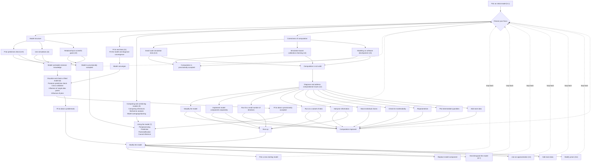

# From Inference to Data Analysis to Workflow

> [!summary]
> Three nested concepts: **Bayesian inference** is conditional probability; **Bayesian data analysis**
> adds model building, checking, and improvement; **Bayesian workflow** adds the comparison of
> multiple models under realistic computation — comparison not for model choice but to *understand*
> the models. This note contains the full transcription of **Figure 2.1**, the master diagram of the
> book, which functions as the routing table for every other chapter.

## Overview

> [!definition] The three nested levels (Ch. 2.1, p. 17)
> - **Bayesian inference** — "simply the use of conditional probability to learn about unknown
>   parameters given data and an assumed generative model."
> - **Bayesian data analysis** — inference *plus* model building, model checking, and improvement,
>   "usually in idealized examples that abstract away from computation and approximation."
> - **Bayesian workflow** — the steps of Bayesian data analysis *plus* the comparison of different
>   models **in the context of realistic computation**.
>
> Crucially: "Comparison is not just for the purpose of model choice or model averaging but also to
> better understand these models and how they work in the context of the problem at hand" — why some
> models have trouble predicting certain aspects of the data, or why uncertainty estimates vary across
> models. **Even when we have a model we like, it is useful to compare its inferences to simpler and
> more complicated models as a way to understand the effect of our modeling choices.**
^def-three-levels

An extended workflow would also include pre-data design of data collection and measurement, and
after-inference decision making; this book focuses on modeling the data, returning to the scientific
extensions in [[Statistical and Scientific Inference]].

> [!important] Bad models are not failures of the workflow — they are the workflow
> "In a typical Bayesian workflow we end up fitting a series of models, some of which are in
> retrospect poor choices … some of which are useful but flawed … and some of which are ultimately
> worth reporting. **The hopelessly wrong models and the seriously flawed models are, in practice,
> unavoidable steps along the way toward fitting the useful models.** Recognizing this can change how
> we set up and apply statistical methods."

### Worked illustration: U.S. presidential election forecasting

> [!example] The three levels applied to one problem (Ch. 2.1, pp. 17-19)
> **Why Bayes helps here:** the outcomes for the 50 states are dependent, so there is no easy way to
> combine 50 separate state forecasts into a national forecast. The Bayesian approach delivers a joint
> distribution — operationally a matrix of simulations, each row one draw from the vector of 50 state
> outcomes — from which any derived quantity follows. Writing $\tilde{y}_j$ for the Republican share
> of the two-party vote in state $j$ and $E_j$ for its electoral votes:
> $$
> \sum_{j=1}^{50} E_j \, \mathbf{1}_{\tilde{y}_j > 0.5}
> $$
> is computed directly from the simulation draws.
>
> **The two steps of Bayesian inference:** (a) obtain the posterior of the parameters given data;
> (b) use the fitted model to predict.
>
> **The additional steps of Bayesian data analysis:** (1) construct the model, typically by *snapping
> together existing smaller models* with which we have experience — linear predictions,
> normally-distributed error terms at state, regional, and national levels, random-walk time series;
> (2) check fit by posterior predictive simulation against past elections; (3) improve the model to
> account for new information and misfit.
>
> **The additional steps of Bayesian workflow:** build, fit, and check a *series* of models — a
> national-vote-only model, a state-polls model, a national-polls model, and simple ways of combining
> them. **Two reasons to fit the simpler models:** to demonstrate what the complicated model has
> gained, and *to figure out how to implement the complicated model* by stitching together simpler
> ones and solving the computational issues one at a time.

## Main Content

### Figure 2.1 — the master workflow diagram

The chart shows possible steps and paths; **any particular analysis will most likely not involve all
of them.** Numbers in parentheses are the sections/chapters where each step is discussed. Colour
coding in the original: green = entry point, cyan = the routing decision, yellow = provisionally
accepted states, pink/magenta = problem states, orange = using the model.

**How to read it as a routing table.** The four branches off "Choose your focus" correspond to the
four things that can be wrong or unknown at any moment:

| Branch | Question it answers | Chapters | Note |
|---|---|---|---|
| **Model structure** | Is the model a defensible description before seeing the fit? | 5.9, 6, 10 | [[Prior Predictive Checking]] |
| **Correctness of computation** | Would this code recover the truth if the model were right? | 6.3, 14, 15 | [[Simulation-Based Calibration - Overview]], [[Modeling as Software Development]] |
| **Fit to real data** | Does the sampler converge, and does the fit match the data? | 11, 12, 8 | [[Fit Fast, Fail Fast]], [[Posterior Predictive Checking]] |
| **Comparing and combining** | What do the alternatives say? | 9 | [[Topology of Models]], [[Stacking and Predictive Model Averaging]] |

Three of the terminal states are **"provisionally accepted"** — never "accepted." The only exit to
"Using the model (7)" runs through provisional acceptance, and the dashed edges show that acceptance
still loops back to "Choose your focus."

Note also the two distinct failure exits from the computational branch: **"Computation improved"**
loops back, while **"Give up"** routes into "Modify the model" — computational failure is treated as
evidence about the model, the [[Failure Modes and Steps Forward|folk theorem]] made structural.

### Figure 2.2 — the meta-workflow of statistical methodology

> [!definition] The codification pipeline (Ch. 2.2, p. 19, Fig. 2.2)
> $$
> \text{Example} \;\cdots\; \text{Case study} \;\cdots\; \text{Workflow} \;\cdots\; \text{Method} \;\cdots\; \text{Theory}
> $$
> New ideas first appear in **examples**, get formalized into **case studies**, are codified as
> **workflows**, given general implementation as algorithms or **methods**, and finally become the
> subject of **theories**.
>
> **"A workflow is more general than an example but less precisely specified than a method."**
>
> **The key claim:** workflow is a *necessary* stage of method and theory development, but **workflow
> itself remains under-theorized and under-supported.** Not all methods reach the final levels of
> abstraction.
^def-meta-workflow

> [!example] Ideas that have traveled left to right (Ch. 2.2, pp. 19-20)
> - **Multilevel modeling** formalizes what was called empirical Bayes estimation of priors, expanding
>   the model to fold inference about priors into a fully Bayesian framework (Tiao and Tan 1965). See
>   [[Empirical Bayes - Overview]].
> - **Exploratory data analysis** can be understood as a form of predictive model checking (Gelman 2003).
> - **Regularization methods** — lasso (Tibshirani 1996), horseshoe (Carvalho, Polson, and Scott
>   2009, 2010; Piironen and Vehtari 2017b) — have replaced simpler variable-selection methods. See
>   [[The Horseshoe Prior]].
> - **Nonparametric models** such as Gaussian processes (O'Hagan 1978; Rasmussen and Williams 2006)
>   can be thought of as Bayesian replacements for kernel smoothing. See
>   [[Hilbert Space Gaussian Processes]].
>
> In each case a framework of methodology was expanded to include existing methods, **along the way
> making the methods more modular and potentially useful.**

### Why we need workflow, not just inference

1. **We do not know ahead of time what model we want to fit.** Even when an acceptable model was
   chosen in advance, we will want to expand it as we gather more data or ask more detailed questions.
2. **Understanding requires comparison.** Even with static data, a known model, and no fitting
   problems, understanding comes from comparing a *series* of related models — "but not just any
   series of models will help. A workflow for building the series is essential."
3. **Different models sometimes yield different conclusions** without one being clearly favorable.
   Presenting multiple models illustrates model uncertainty and **avoids the trap of capitalizing on
   researcher degrees of freedom to reach a desired result.**
4. **Different models sometimes yield the same conclusions** — which is *not* a reason to regret
   fitting them. A more complex, presumably more realistic model may not change conclusions because
   there is not enough information in the data about the new parameters; presenting both "is helpful
   to figure out the limitations in what we can learn from a sample."
5. **Computation is a challenge.** Complex models cannot usually be fit on the first try.

### Why is Bayesian workflow so complicated?

Textbook workflows are linear: a clinical trial runs sample-size calculation → analysis plan → data
collection → cleaning → analysis → $p$-values and confidence intervals; an observational economics
study runs EDA → transformations → regressions → robustness checks. The workflow of this book is more
tangled, for four reasons:

1. **We start deliberately incomplete.** The general model we have in mind is more complex than we can
   computationally fit (correlations, hierarchy, time-varying parameters) or than the data can
   resolve, so we start with a model *known* to be missing important features, intending to add them.
2. **Data are not fixed.** Collection is ongoing or related datasets can be folded in. "A linear model
   might fit well at first but then break down when data are added under new conditions."
3. **Computation itself requires experimentation** — solving the problem of computing, approximating,
   or simulating from the posterior, *and* checking the algorithm did what was intended.
4. **Models are best understood by comparison** to alternatives.

> [!important] The layered uncertainty
> "In addition to the usual uncertainties in the data and model parameters, we are often uncertain
> whether we are fitting our models correctly, uncertain about how best to set up and expand our
> models, and uncertain in their interpretation."

### Shortcuts, and how to think about them

Practical constraints — time, compute, the severity of penalties for being wrong — motivate shortcuts.
The authors' position is not to forbid them but to **understand shortcuts explicitly as approximations
to the full workflow**, so practitioners can make informed choices about where to spend limited energy.

> [!warning] Avoid the exact/approximate false dichotomy (Ch. 2.2, p. 22)
> "Not fitting a model at all could be worse than fitting it using an approximate computation," where
> *approximate* means "methods that won't give more accurate approximations as you run them for
> longer."
>
> But the categories leak in both directions: **"You can build methods (like many Markov chains) that
> will compute posteriors exactly if run for infinite time, but if you run them for a month they can
> still be horrifically wrong. You can also build approximate methods that will be accurate up to 10
> decimal places, but the accuracy cannot be improved."**
>
> **The advice: treat each approximate method and each Markov chain as its own entity and avoid
> getting dragged into false dichotomies.** See [[Approximate Algorithms and Approximate Models]].

### Workflow is not automatable — and that is not a defect

The general approach of building, checking, and expanding models was expressed by Tukey (1977),
Box (1980), and Jaynes (1983). A common feature is **respect for analyst subjectivity and expertise**:

> "Model checking and revision is not a linear process governed only by objective criteria. It is also
> steered and often improved by **surprise, revelation, confusion, and imagination**. These subjective
> processes are synergistic with objective procedures, and model checking workflow in this view is not
> automated nor could it be automated. However steps like model fitting and comparison can be partly
> automated to aid analysts."

## Connections

- Figure 2.1 is the routing table for the entire book; every note in this folder occupies a box in it.
- The meta-workflow of Figure 2.2 explains the *structure of the book itself*: Part 4's case studies
  are the "case study" stage, Parts 2-3 the "workflow" stage.
- The "unavoidable bad models" claim is formalized as the ladder in [[Four Modeling Scenarios]].
- Reason 3 above (researcher degrees of freedom) connects to
  [[Forking Paths and Bayesian Approaches]] and [[The Replication Crisis and Multiple Levels of Variation]].

## See Also
- [[Bayesian Workflow - Overview]] — the 2020 arXiv paper's shorter version of this same argument
- [[Four Modeling Scenarios]] — the ladder from "programming error" to "model contains the truth"
- [[Computational Tools and Probabilistic Programming]] — the software that makes the loop fast enough to iterate
- [[Statistical and Scientific Inference]] — workflow embedded in the larger scientific cycle
